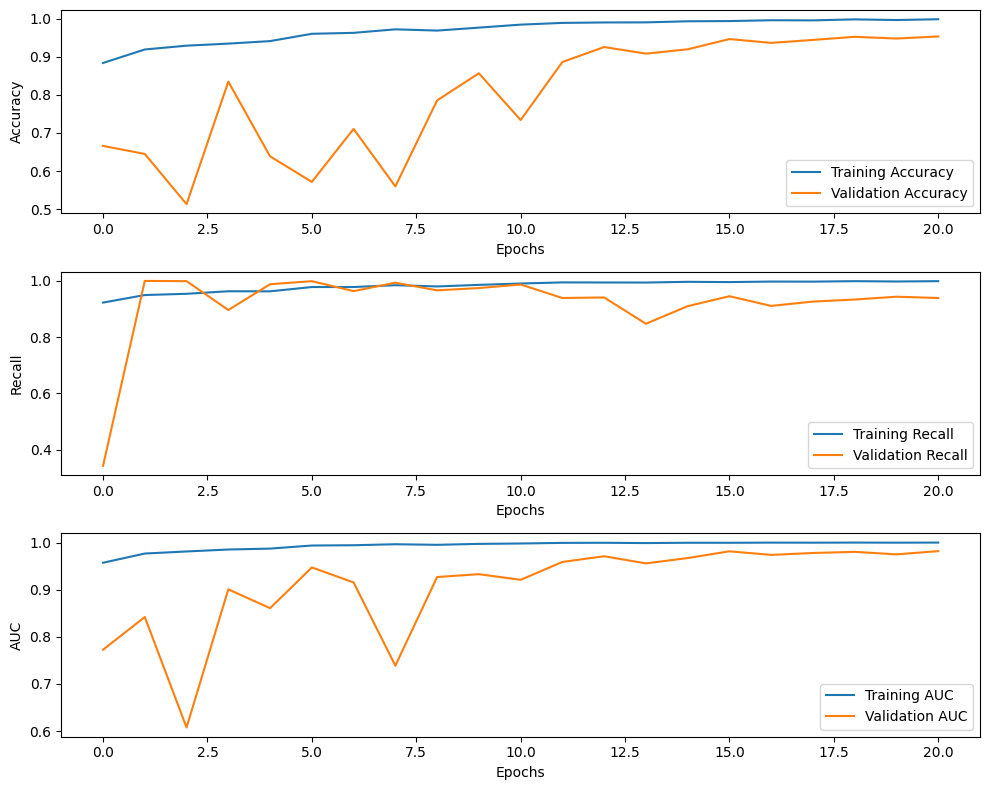

# Melodate (Machine Learning part)

## Introduction

Melodate is a music preference-based dating application that aims to create a more authentic and personalized matchmaking experience by utilizing users' music tastes. By focusing on musical interests rather than superficial qualities, Melodate connects users with potential matches who share similar lifestyle compatibilities and music preferences, enhancing the likelihood of meaningful connections.

## Project Team

- **Mia** - Machine Learning - Universitas Bunda Mulia
- **Vincent Pangdipta** - Machine Learning - Universitas Bunda Mulia
- **Lukas Krisna Prastiyan** - Machine Learning - Sekolah Tinggi Ilmu Komputer Yos Sudarso
- **Dedy Faradzi** - Cloud Computing - Universitas Pamulang
- **Medica Normalika Zakiah** - Cloud Computing - Universitas Pembangunan Nasional Veteran Jawa Timur
- **Alvin Hartono** - Mobile Development - Universitas Bunda Mulia
- **Bryan Nathaniel** - Mobile Development - Universitas Bunda Mulia

## Project Scope & Deliverables

### Scope

- Develop a music preference-based matching algorithm with machine learning to pair users with similar tastes.
- Design a user-friendly UI/UX for enhanced user interaction.
- Implement core functionalities including user profile creation, match discovery, and chat features.

### Deliverables

- User interface design mockups.
- A functional Android app prototype with core features implemented.
- Comprehensive technical documentation of the project.

## Technologies Used

### Mobile Development

- **Android Studio** - IDE for Android app development.
- **Kotlin** - Primary programming language.
- **Figma** - UI design.
- **Material Design Components, Retrofit, Room Database** - For UI components, network operations, and local data storage respectively.

### Cloud & Backend

- **Visual Studio Code** - Development environment.
- **Docker, Cloud Run, Cloud SQL** - For containerization, serverless operations, and database management.
- **Node.js, Express.js, Flask** - Backend development frameworks.
- **JavaScript** - Programming language for backend.

### Machine Learning

- **Jupyter Notebook** - Interactive computational environment.
- **Pandas, NumPy, TensorFlow, Keras, Scikit-Learn** - For data manipulation, computation, and machine learning operations.
- **Kaggle** - Dataset platforms.

## Getting Started

Clone the repository and navigate to the project directory. Detailed setup and run instructions will be provide soon.

# Machine Learning Overview

## Objective

The objective of recommender feature is to develop a sophisticated recommender system that can accurately predict and suggest potential matches based on users' music preferences. This system is at the core of Melodate's functionality, enabling the application to pair individuals based on shared musical tastes rather than traditional, often superficial matchmaking criteria.

The primary goal of anti porn feature is to develop a machine learning model capable of distinguishing between safe-for-work (SFW) and not-safe-for-work (NSFW) content in images.

### NSFW Classification Model

## License

## Contact
